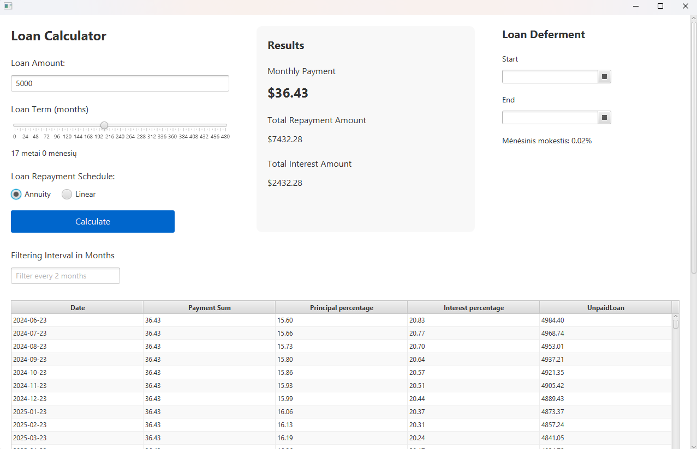

# Loan Calculator

A JavaFX application for calculating and visualizing loan repayment schedules.

## Features

- Calculate loan repayments using annuity or linear methods
- Visualize payment schedules with interactive charts
- Adjust loan amount, term, and interest rate
- Set loan deferment periods
- Filter and view payment details in a table
- Export results as CSV and chart as PNG
- 
.png)

## Usage

1. Enter loan amount and term
2. Select repayment method (annuity or linear)
3. Set loan deferment dates (optional)
4. Click "Calculate" to view results
5. Use the filter to adjust payment schedule view
6. Export data and charts as needed

## Technical Details

- Built with JavaFX
- Uses FXML for UI layout
- Implements dynamic chart generation
- Supports data export to CSV and PNG formats

## Requirements

- Java 17 or higher
- JavaFX runtime

## Installation

Clone the repository and run using your preferred Java IDE or build tool.
